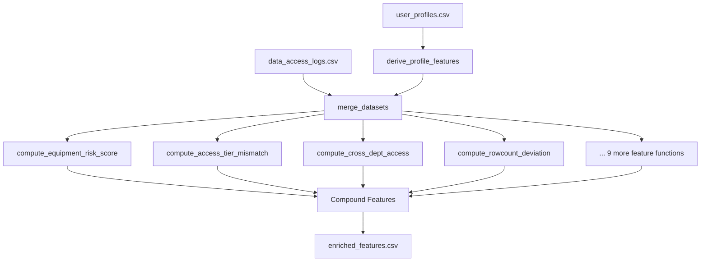

# Neuro-SOC — Data Pipeline (Feature Enrichment)

> Transforms raw access logs and user profiles into a **23-feature numerical matrix** optimised for unsupervised anomaly detection with Isolation Forest.

---

## Overview

The data pipeline is the foundation of the Neuro-SOC ML engine. It ingests two raw CSV files, merges them on `user_id`, engineers 23 security-relevant numerical features, and exports an ML-ready dataset. Every feature is designed to capture a specific insider threat signal — from privilege escalation and cross-department access to temporal bursts and exfiltration destination risk.

```
raw_data/data_access_logs.csv  ──┐
                                 ├──▶ enrichment.py ──▶ processed_data/enriched_features.csv
raw_data/user_profiles.csv     ──┘                       (50,000 rows × 26 cols)
```

---

## Tech Stack

| Technology | Purpose |
|-----------|---------|
| **Python 3.11+** | Runtime |
| **Pandas ≥ 2.2** | Data loading, merging, transformation, and export |
| **NumPy ≥ 1.26** | Numerical computation (log transforms, clipping, vectorised operations) |

---

## Input Data

### `raw_data/data_access_logs.csv` — Access Events

| Column | Description |
|--------|-------------|
| `access_id` | Unique event identifier |
| `timestamp` | Event timestamp (ISO 8601) |
| `user_id` | Employee identifier (FK → user_profiles) |
| `username` | Human-readable name |
| `department` | Organisational department (Finance, IT, HR, Engineering, etc.) |
| `data_asset` | Data resource accessed (e.g., `Financial_Ledger`, `HR_Records`) |
| `data_sensitivity` | Sensitivity classification: `low`, `medium`, `high`, `restricted` |
| `data_category` | Data category: Financial, Technical, HR, PII, Legal, Operational |
| `query_type` | Database operation: `select`, `export`, `bulk_download`, `delete`, `update`, `insert` |
| `rowcount` | Number of records accessed |
| `access_method` | How data was accessed (API, web portal, CLI, etc.) |
| `destination` | Where data was sent: `internal_server`, `usb_drive`, `external_email`, `cloud_storage`, etc. |
| `status` | Access result: `success` or `failure` |
| `source_ip` | Client IP address |
| `bytes_transferred` | Volume of data transferred |
| `session_duration_min` | Session duration in minutes |
| `client_application` | Application used for access |
| `authentication_method` | Auth method: `mfa`, `sso`, `password_only`, `api_key` |
| `is_vpn` | Whether VPN was used |
| `geo_location` | Geographic origin of the access |
| `time_classification` | Time of day classification: `business_hours`, `after_hours`, `night`, `weekend`, `early_morning` |
| `anomaly_marker` | Ground-truth label marker |

### `raw_data/user_profiles.csv` — Employee Profiles

| Column | Description |
|--------|-------------|
| `user_id` | Primary key |
| `username`, `email` | Identity fields |
| `department`, `job_title` | Organisational context |
| `access_tier` | Clearance level: `junior`, `contractor`, `standard`, `senior`, `admin` |
| `tenure_months` | Employment duration |
| `approved_data_assets` | Pipe-delimited list of authorised data assets |
| `avg_queries_per_day` | Historical baseline query volume |
| `typical_access_hours` | Normal working hours |
| `avg_rowcount_per_query` | Historical baseline row volume |
| `high_risk_flag` | HR flag: PIP, termination notice, investigation |
| `equipment` | Device type: `corporate_laptop`, `contractor_machine`, etc. |
| `clearance_level` | Security clearance |
| `notice_period` | Whether the employee is serving notice |
| `last_performance_rating` | Latest performance review score |
| `security_training_current` | Whether security training is up to date |
| `failed_logins_30d` | Failed login attempts in last 30 days |
| `vpn_user` | Whether the employee is a registered VPN user |
| `last_access_date` | Date of most recent account activity |

---

## Engineered Features (23 Total)

### User Profile Features (6)

| # | Feature | Anomaly Type | Description |
|---|---------|-------------|-------------|
| 1 | `tenure_months` | Baseline | Employment duration — proxy for institutional trust |
| 2 | `high_risk_flag` | Risk modifier | HR flag for PIP, termination notice, or active investigation |
| 3 | `notice_period_flag` | Pre-Resignation Download | Binary: employee is currently serving notice period |
| 4 | `failed_logins_30d` | Failed Auth Burst | Count of failed authentication attempts in the past 30 days |
| 5 | `stale_account_days` | Stale Account Access | Days since the account was last active |
| 6 | `approved_assets_count` | Scope Baseline | Number of data assets the employee is authorised to access |

### Computed Risk Modifiers (4)

| # | Feature | Anomaly Type | Description |
|---|---------|-------------|-------------|
| 7 | `Tenure_Risk_Modifier` | Pre-Resignation + Baseline | Amplified risk: 3.0× for short-tenure + high-risk, 2.0× for long-tenure + high-risk, 1.5× for short-tenure only |
| 8 | `Equipment_Risk_Score` | Device Anomaly | Flags contractor machines and external IPs accessing sensitive data |
| 9 | `Access_Tier_Mismatch` | Privilege Escalation | `max(0, sensitivity_score − tier_score)` — accessing data above clearance |
| 10 | `Cross_Dept_Access_Flag` | Cross-Department Access | Binary: data asset is NOT in the user's approved list |

### Per-Event Features (6)

| # | Feature | Anomaly Type | Description |
|---|---------|-------------|-------------|
| 11 | `Rowcount_Deviation` | Bulk Export | `rowcount / avg_rowcount_per_query` — volume anomaly detection |
| 12 | `Exfiltration_Dest_Score` | Exfiltration Risk | Destination risk: USB/external email = 3, cloud = 2, internal = 0 |
| 13 | `Query_Type_Risk` | Bulk Export / Exfiltration | Query risk: export/bulk_download = 3, delete = 2, update = 1, select = 0 |
| 14 | `Weak_Auth_Flag` | Night Bulk Critical | Binary: `password_only` or `api_key` authentication |
| 15 | `Suspicious_Geo_Flag` | Night Bulk Critical | Binary: access from Pyongyang, Tor Exit Node, Unknown VPN, etc. |
| 16 | `VPN_Mismatch` | Device Anomaly | Binary: VPN usage inconsistent with employee's profile |

### Temporal Features (3)

| # | Feature | Anomaly Type | Description |
|---|---------|-------------|-------------|
| 17 | `Temporal_Velocity` | Bulk Export (burst) | Rolling 1-hour event count per user — detects rapid-fire access |
| 18 | `After_Hours_High_Sensitivity` | After-Hours Restricted | Binary: off-hours access to high/restricted data |
| 19 | `Failed_Action_Flag` | Failed Auth Burst | Binary: access attempt resulted in failure/denial |

### Compound Features (4)

These combine individually weak signals into stronger composite indicators:

| # | Feature | Formula | Purpose |
|---|---------|---------|---------|
| 20 | `Cross_Dept_Sensitivity` | `Cross_Dept_Access_Flag × sensitivity_score` | Amplifies cross-department access to HIGH/RESTRICTED data |
| 21 | `Time_Sensitivity_Risk` | `time_risk_weight × sensitivity_score` | Amplifies off-hours access to sensitive resources |
| 22 | `Stale_Sensitivity_Risk` | `log1p(stale_account_days) × sensitivity_score` | Amplifies dormant account accessing sensitive data |
| 23 | `Volume_Dest_Compound` | `log1p(Rowcount_Deviation) × Exfiltration_Dest_Score` | Amplifies high-volume exports to risky destinations |

---

## Directory Structure

```
data_pipeline/
├── enrichment.py             # Main pipeline script — Load → Derive → Merge → Engineer → Export
├── __init__.py               # Package marker
├── raw_data/                 # Input CSVs (gitignored if large)
│   ├── data_access_logs.csv  # 50,000 access events × 22 columns
│   ├── data_access_labels.csv# Ground truth anomaly labels (for evaluation)
│   └── user_profiles.csv     # 101–500 employee profiles × 20 columns
└── processed_data/           # Output
    └── enriched_features.csv # ML-ready feature matrix (50,000 × 26)
```

---

## Usage

### Run the Pipeline

```bash
cd neuro_soc/data_pipeline
python enrichment.py
```

The pipeline will:
1. Load `raw_data/data_access_logs.csv` and `raw_data/user_profiles.csv`
2. Derive profile-level features (notice period, stale days, approved asset count, tenure risk)
3. Left-join logs with profiles on `user_id`
4. Engineer all 23 per-event features
5. Export `processed_data/enriched_features.csv`

### Output

The enriched CSV contains:
- **ID columns**: `access_id`, `user_id`, `timestamp` (for joining with labels)
- **23 numeric features**: Ready for StandardScaler → Isolation Forest

---

## Pipeline Flow



---

*Part of the [Neuro-SOC](../../README.md) Insider Threat Detection System*
